<div align="center">
  
  <h1>SysAdmin</h1>
  <p><i><b>Linux server management in your pocket</b></i></p>

<a href="https://github.com/prathameshkhade/SysAdmin/releases" alt="GitHub release"></a>
[](LICENSE)
[](https://flutter.dev/)
[](https://github.com/prathameshkhade/SysAdmin/stargazers)
[](https://github.com/prathameshkhade/SysAdmin/network/members)
[](CONTRIBUTING.md)

> *"Command your servers, not your schedule. Admin anywhere, anytime."*
</div>

## 🔍 Overview

**SysAdmin** is an open-source mobile application that puts the power of Linux server administration in your pocket. Built with Flutter, it provides a sleek, intuitive GUI for managing your Linux servers on the go - no laptop required.

> *"When your server needs you, but your laptop is at home."*

> [!warning]
> <b>THIS APP IS IN BETA, SO YOU MAY ENCOUNTER BUGS. IF YOU DO, OPEN AN ISSUE IN OUR GITHUB REPOSITORY BY FILLING OUT THE ISSUE TEMPLATE.</b>
> 
> <b>PUTTING SYSADMIN, OR ANY FORK OF IT, INTO THE GOOGLE PLAY STORE VIOLATES THEIR TERMS AND CONDITIONS.</b>

## Screenshots

[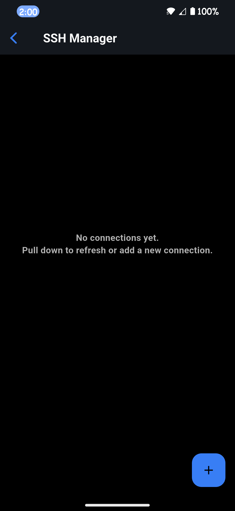](fastlane/metadata/android/en-US/images/phoneScreenshots/01.png)
[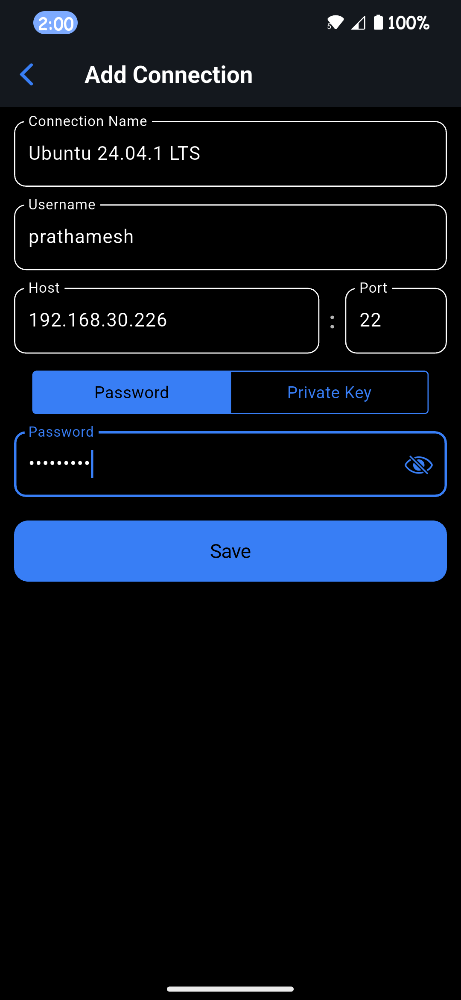](fastlane/metadata/android/en-US/images/phoneScreenshots/02.png)
[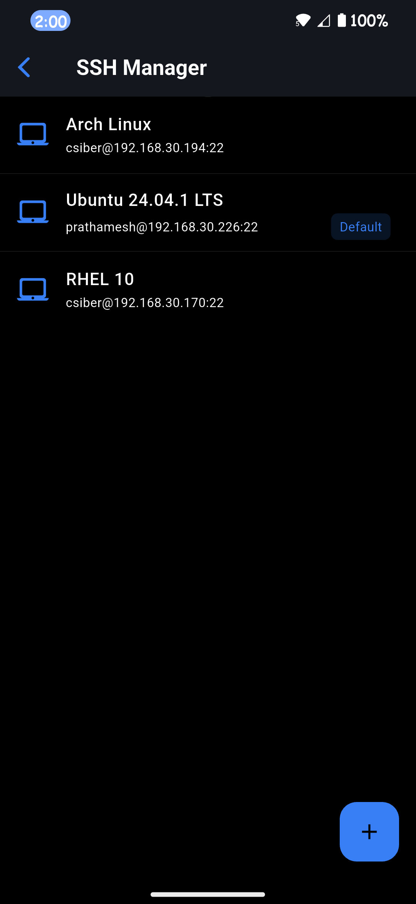](fastlane/metadata/android/en-US/images/phoneScreenshots/03.png)
[](fastlane/metadata/android/en-US/images/phoneScreenshots/04.png)
[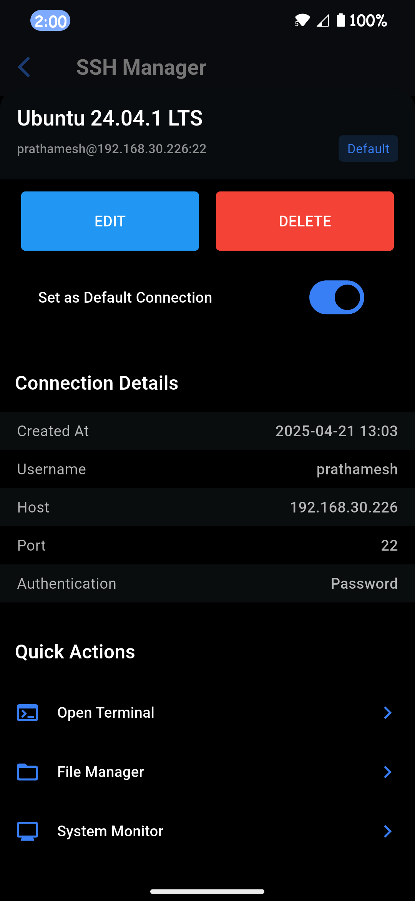](fastlane/metadata/android/en-US/images/phoneScreenshots/05.png)
[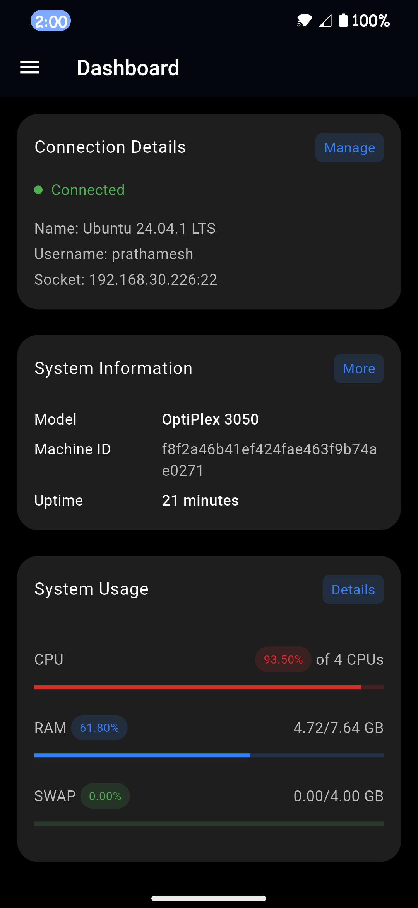](fastlane/metadata/android/en-US/images/phoneScreenshots/06.png)
[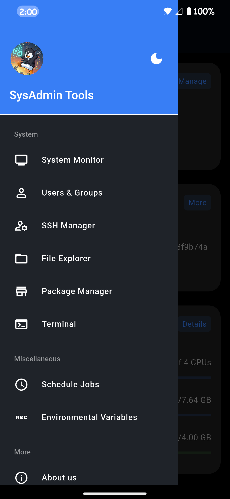](fastlane/metadata/android/en-US/images/phoneScreenshots/07.png)
[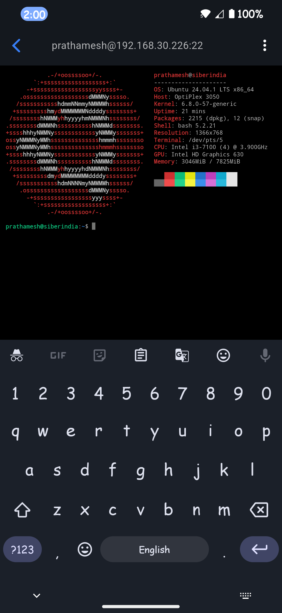](fastlane/metadata/android/en-US/images/phoneScreenshots/08.png)
[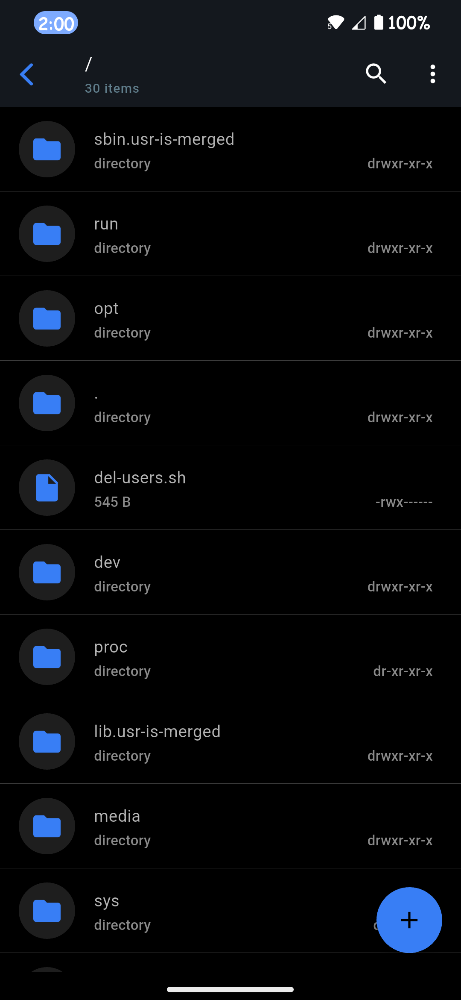](fastlane/metadata/android/en-US/images/phoneScreenshots/09.png)
[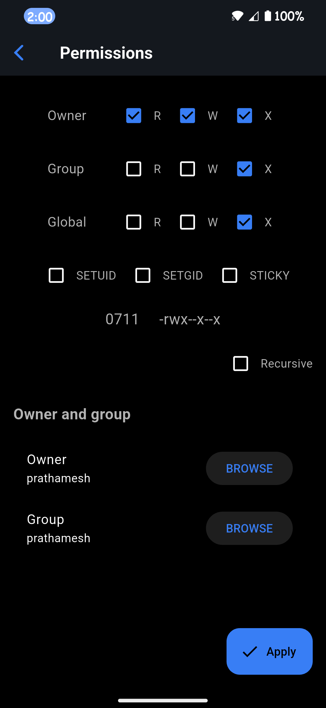](fastlane/metadata/android/en-US/images/phoneScreenshots/10.png)
[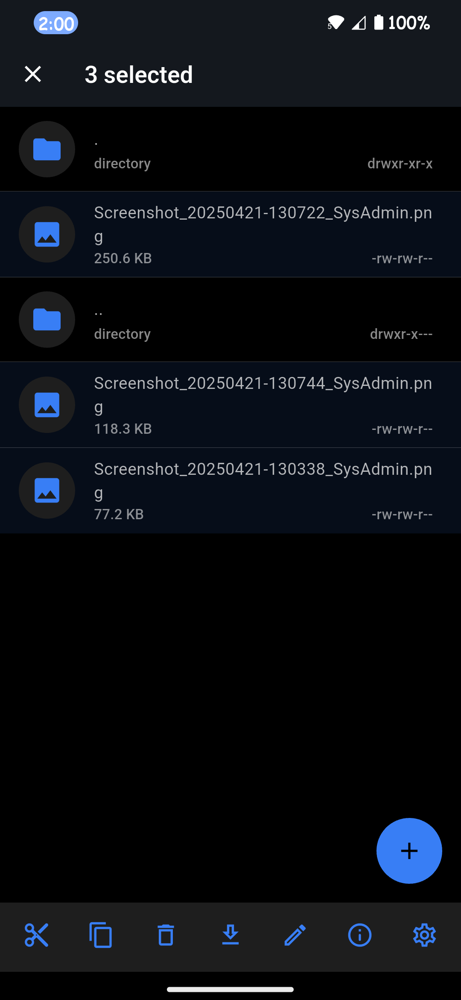](fastlane/metadata/android/en-US/images/phoneScreenshots/11.png)
[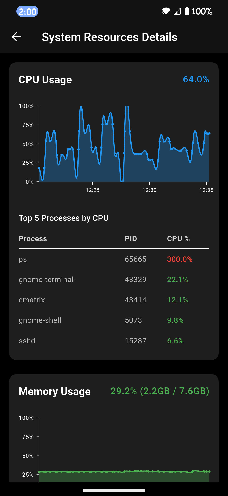](fastlane/metadata/android/en-US/images/phoneScreenshots/12.png)
[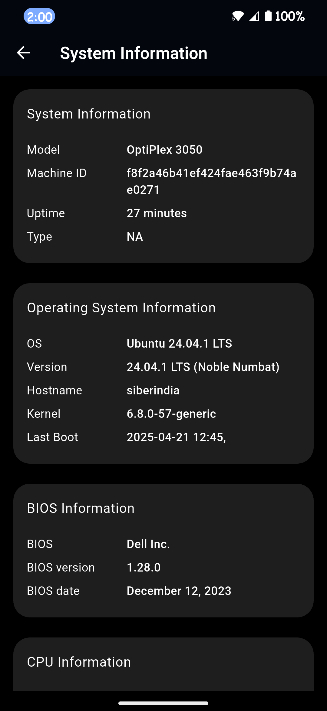](fastlane/metadata/android/en-US/images/phoneScreenshots/13.png)
[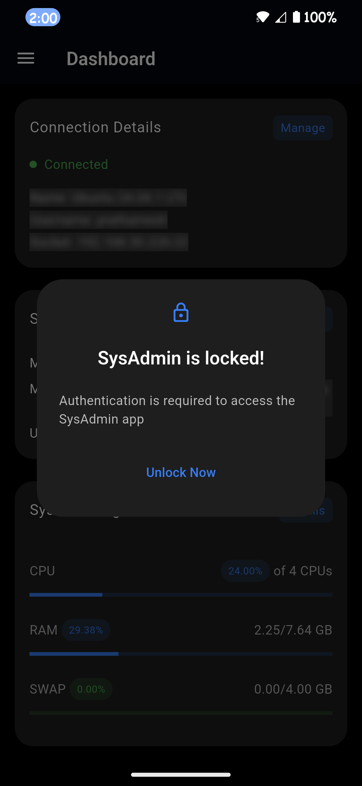](fastlane/metadata/android/en-US/images/phoneScreenshots/14.png)
[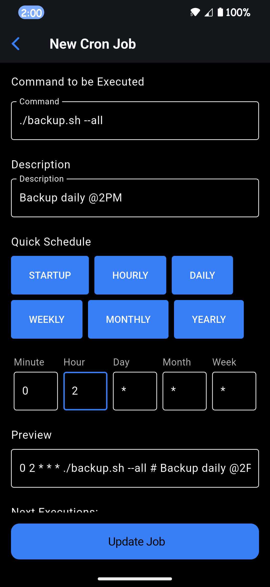](fastlane/metadata/android/en-US/images/phoneScreenshots/15.png)
[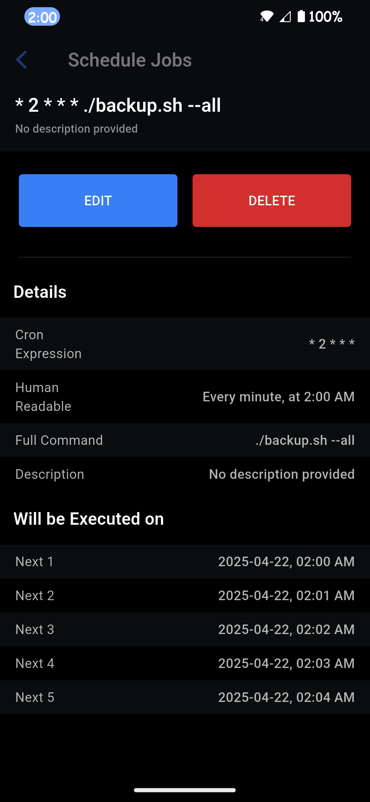](fastlane/metadata/android/en-US/images/phoneScreenshots/16.png)
[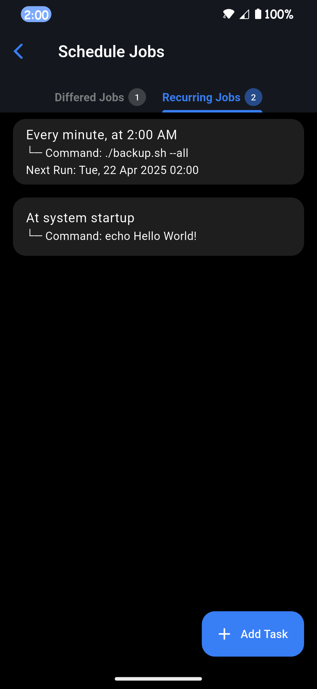](fastlane/metadata/android/en-US/images/phoneScreenshots/17.png)

## 🌟 Why SysAdmin?

Traditional server management requires either physical access or an SSH session through a terminal, which can be inconvenient when you're on the move. **SysAdmin** solves this by providing:

- [x] **Mobile-First GUI** for Linux server management
- [x] **Multi-Server Support** - manage all your servers from one app
- [x] **Secure Connections** using SSH/SFTP with password or key-based authentication
- [x] **No Command Line Required** (but available when you need it!)
- [x] **Environmentally Friendly** - uses less energy than keeping a laptop running

> *"Because the command line should be a choice, not a necessity."*

## 🚀 Key Features

### Currently Available

- **Dashboard** - View server status, system metrics, and connection details at a glance
- **SSH Manager** - Store and manage multiple server connections securely
- **System Information** - Detailed hardware information about your connected server
- **Real-time System Resource Monitoring** - Track CPU, RAM, and swap usage with graphs
- **SFTP File Explorer** - Browse, upload, download, and manage files with ease
- **Schedule Jobs** - Create one-time and recurring tasks
- **Environment Variables** - Manage both local and global environment variables
- **Terminal** - Full terminal access when you need the command line

### Coming Soon

- **User & Group Management**
- **Service & Log Management**
- **Package Management**
- **Firewall Configuration**
- **Container Management** (Docker/Podman)
- **Disk & Network Management**
- **VNC Support**

## 🔍 Understanding The Problem

As a Linux system administrator, you may have faced these challenges:

- 💻 **Always needing a laptop** to connect to your servers
- ⏱️ **Time wasted** turning on devices, connecting, and executing repetitive commands
- 🔄 **Repetitive tasks** that could be simplified with a GUI
- 🔋 **Energy consumption** from keeping a laptop running for quick server checks

SysAdmin addresses these issues by providing a comprehensive mobile solution that puts powerful server management tools in your pocket.

## 💡 Project Architecture

```shell
lib/
│
├── core/                     # Core system-wide constants, utilities, and base classes
│   ├── constants/            # App-wide constants (colors, dimensions, strings, etc.)
│   ├── utils/                # Utility/helper functions (e.g., validators, formatters)
│   ├── theme/                # Theme and styling information
│   └── widgets/              # Shared reusable widgets across the app
│
├── data/                     # Data layer for managing data sources
│   ├── models/               # Data models representing application entities (User, SSH Connection, etc.)
│   ├── repositories/         # Abstraction of data sources (local, remote API, etc.)
│   └── services/             # Logic for handling services like network, authentication, etc.
│
├── domain/                   # Domain layer for business logic
│   ├── entities/             # Core business entities
│   ├── usecases/             # Application-specific business logic
│   └── interfaces/           # Interfaces for repositories or services
│
├── presentation/             # UI layer - Screens, Widgets, and State management
│   ├── screens/              # All major screens and pages (onboarding, dashboard, settings, etc.)
│   │   ├── onboarding/       # Screens related to onboarding
│   │   ├── dashboard/        # Main admin dashboard
│   │   ├── user_management/  # User and Group management screens
│   │   ├── ssh_management/   # SSH connections management screens
│   │   ├── sftp/             # File transfer (SFTP) management screens
│   │   └── ...               # More feature screens (logs, services, cron jobs, etc.)
│   └── widgets/              # Reusable widgets (buttons, cards, dialogs) specific to the presentation layer
│
├── providers/                # State management (e.g., Riverpod, Provider, etc.)
│   └── ssh_state.dart        # Global application state (loading, session, etc.)
│
├── routes/                   # Application navigation and routing
│   └── app_routes.dart       # App's route definitions and navigators
│
├── config/                   # Environment-based configurations
│   ├── env/                  # Separate config files for dev, staging, production
│   └── app_config.dart       # Main configuration file
│
└── main.dart                 # App entry point
```

## 🛡️ Security Features

Security is our top priority. SysAdmin implements:

- **Local Authentication** - Biometric/pin protection using your device's screen lock
- **Encrypted Communications** - All server communications use SSH/SFTP encryption
- **Secure Credential Storage** - Connection details are stored in your device's secure storage
- **No Server-side Components** - Your credentials never leave your device

## 🌱 Sustainable Development Goals

SysAdmin contributes to several UN Sustainable Development Goals:

- **SDG 4 (Quality Education)** - Making server management more accessible to beginners
- **SDG 8 (Decent Work and Economic Growth)** - Increasing productivity and supporting remote work
- **SDG 9 (Industry, Innovation, and Infrastructure)** - Promoting innovation with mobile-friendly server management
- **SDG 11 (Sustainable Cities and Communities)** - Supporting smart infrastructure with less energy usage
- **SDG 17 (Partnerships for the Goals)** - Encouraging open-source collaboration

## 🚀 Getting Started

### Prerequisites

- Flutter SDK (latest stable version)
- Android Studio or VS Code with Flutter extensions
- A test Linux server with SSH access

### Installation

1. **Clone the repository:**
   ```bash
   git clone https://github.com/prathameshkhade/SysAdmin.git
   cd SysAdmin
   ```

2. **Install dependencies:**
   ```bash
   flutter pub get
   ```

3. **Run the app:**
   ```bash
   flutter run
   ```

### First-time Setup

1. Launch the app
2. Navigate to SSH Manager and add your first server connection
3. Set your preferred connection as default
4. Explore the dashboard and features!

## 🤝 Contributing

We welcome contributions from everyone! Whether you're fixing bugs, improving documentation, or proposing new features, your help is appreciated.

Please read our [Contribution Guidelines](CONTRIBUTING.md) before submitting a pull request.

> *"In open source, we feel strongly that to really do something well, you have to get a lot of people involved."* - Linus Torvalds

## 📜 License
<div align='center'>   
   <a href="https://www.gnu.org/licenses/gpl-3.0.en.html">   
      
   </a>
</div>

<p>SysAdmin is Free Software: You can use, study, share, and improve it at will.
<p>Specifically you can redistribute and/or modify it under the terms of the <a href="https://www.gnu.org/licenses/gpl.html">GNU General Public License</a> as published by the Free Software Foundation, either version 3 of the License, or (at your option) any later version.

## 📬 Contact

Questions or feedback? Reach out at [pkhade2865+sysadmin@gmail.com](mailto:pkhade2865+sysadmin@gmail.com) or report an issue [GitHub Issues](https://github.com/prathameshkhade/SysAdmin/issues)

---

<div align="center">
  <h3><b>Made with  by <i>prathameshkhade</i></b></h3>
  <p><i>Because server management shouldn't require a desk.</i></p>
</div>
