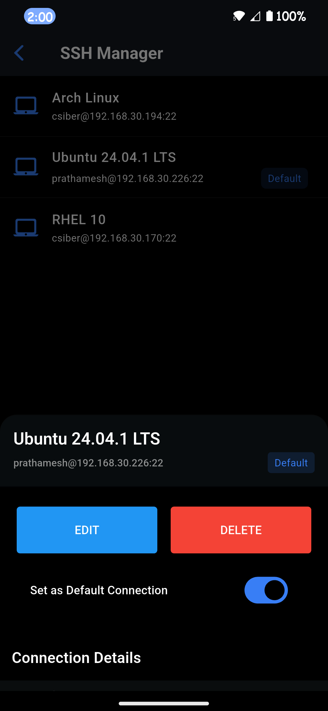

<p align="center">
   <picture>
      
   </picture>
   <br>
   <h3 align="center">SysAdmin</h3>
   <br>
   <i><b>Linux server management in your pocket</b></i>
   <br><br>
   <a href="https://apt.izzysoft.de/fdroid/index/apk/com.sysadmin.sysadmin">
      
   </a>
   <a href="https://www.openapk.net/sysadmin-linux-server-management/com.sysadmin.sysadmin/">
      
   </a>
   <br><br>
   <a href="https://github.com/prathameshkhade/SysAdmin/releases">
      
   </a>
   <a href="LICENSE">
      
   </a>
   <a href="https://flutter.dev/">
      
   </a>
   <a href="https://github.com/prathameshkhade/SysAdmin/stargazers">
      
   </a>
   <a href="https://github.com/prathameshkhade/SysAdmin/network/members">
      
   </a>
   <a href="CONTRIBUTING.md">
      
   </a>
   <br><br>
</p>

> *"Command your servers, not your schedule. Admin anywhere, anytime."*

## 🔍 Overview

**SysAdmin** is an open-source mobile application that puts the power of Linux server administration in your pocket. Built with Flutter, it provides a sleek, intuitive GUI for managing your Linux servers on the go - no laptop required.

> *"When your server needs you, but your laptop is at home."*

> [!warning]
> <b>THIS APP IS IN BETA, SO YOU MAY ENCOUNTER BUGS. IF YOU DO, OPEN AN ISSUE IN OUR GITHUB REPOSITORY BY FILLING OUT THE ISSUE TEMPLATE.</b>
> 
> <b>PUTTING SYSADMIN, OR ANY FORK OF IT, INTO THE GOOGLE PLAY STORE VIOLATES THEIR TERMS AND CONDITIONS.</b>

## Screenshots

[](fastlane/metadata/android/en-US/images/phoneScreenshots/01.png)
[](fastlane/metadata/android/en-US/images/phoneScreenshots/02.png)
[](fastlane/metadata/android/en-US/images/phoneScreenshots/03.png)
[](fastlane/metadata/android/en-US/images/phoneScreenshots/04.png)
[](fastlane/metadata/android/en-US/images/phoneScreenshots/05.png)
[](fastlane/metadata/android/en-US/images/phoneScreenshots/06.png)
[](fastlane/metadata/android/en-US/images/phoneScreenshots/07.png)
[](fastlane/metadata/android/en-US/images/phoneScreenshots/08.png)
[](fastlane/metadata/android/en-US/images/phoneScreenshots/09.png)
[](fastlane/metadata/android/en-US/images/phoneScreenshots/10.png)
[](fastlane/metadata/android/en-US/images/phoneScreenshots/11.png)
[](fastlane/metadata/android/en-US/images/phoneScreenshots/12.png)
[](fastlane/metadata/android/en-US/images/phoneScreenshots/13.png)
[](fastlane/metadata/android/en-US/images/phoneScreenshots/14.png)
[](fastlane/metadata/android/en-US/images/phoneScreenshots/15.png)
[](fastlane/metadata/android/en-US/images/phoneScreenshots/16.png)
[](fastlane/metadata/android/en-US/images/phoneScreenshots/17.png)

## 🔍 Understanding The Problem

As a Linux system administrator, you may have faced these challenges:

- 💻 **Always needing a laptop** to connect to your servers
- ⏱️ **Time wasted** turning on devices, connecting, and executing repetitive commands
- 🔄 **Repetitive tasks** that could be simplified with a GUI
- 🔋 **Energy consumption** from keeping a laptop running for quick server checks

SysAdmin addresses these issues by providing a comprehensive mobile solution that puts powerful server management tools in your pocket.

## 🌟 Why SysAdmin?

Traditional server management requires either physical access or an SSH session through a terminal, which can be inconvenient when you're on the move. **SysAdmin** solves this by providing:

- [x] **Mobile-First GUI** for Linux server management
- [x] **Multi-Server Support** - manage all your servers from one app
- [x] **Secure Connections** using SSH/SFTP with password or key-based authentication
- [x] **No Command Line Required** (but available when you need it!)
- [x] **Environmentally Friendly** - uses less energy than keeping a laptop running

> *"Because the command line should be a choice, not a necessity."*

## 🚀 Key Features

### Currently Available:

- **Dashboard** - View server status, system metrics, and connection details at a glance
- **SSH Manager** - Store and manage multiple server connections securely
- **System Information** - Detailed hardware information about your connected server
- **Real-time System Resource Monitoring** - Track CPU, RAM, and swap usage with graphs
- **SFTP File Explorer** - Browse, upload, download, and manage files with ease
- **Schedule Jobs** - Create one-time and recurring tasks
- **Environment Variables** - Manage both local and global environment variables
- **Terminal** - Full terminal access when you need the command line

### Coming Soon:

- **User & Group Management**
- **Service & Log Management**
- **Package Management**
- **Firewall Configuration**
- **Container Management** (Docker/Podman)
- **Disk & Network Management**
- **VNC Support**

## 🌱 Sustainable Development Goals

SysAdmin contributes to several UN Sustainable Development Goals:

- **SDG 4 (Quality Education)** - Making server management more accessible to beginners
- **SDG 8 (Decent Work and Economic Growth)** - Increasing productivity and supporting remote work
- **SDG 9 (Industry, Innovation, and Infrastructure)** - Promoting innovation with mobile-friendly server management
- **SDG 11 (Sustainable Cities and Communities)** - Supporting smart infrastructure with less energy usage
- **SDG 17 (Partnerships for the Goals)** - Encouraging open-source collaboration

## 🛡️ Security Features

Security is our top priority. SysAdmin implements:

- **Local Authentication** - Biometric/pin protection using your device's screen lock
- **Encrypted Communications** - All server communications use SSH/SFTP encryption
- **Secure Credential Storage** - Connection details are stored in your device's secure storage
- **No Server-side Components** - Your credentials never leave your device

## 🚀 Getting Started

### Prerequisites

- Flutter SDK (latest stable version)
- Android Studio or VS Code with Flutter extensions
- A test Linux server with SSH access

### Installation

1. **Clone the repository:**
   ```bash
   git clone https://github.com/prathameshkhade/SysAdmin.git
   cd SysAdmin
   ```

2. **Install dependencies:**
   ```bash
   flutter pub get
   ```

3. **Run the app:**
   ```bash
   flutter run
   ```

### Setting up for first time?

1. Launch the app
2. Navigate to SSH Manager and add your first server connection
3. Set your preferred connection as default
4. Explore the dashboard and features!

## 💡 Project Architecture

```shell
lib/
│
├── core/                     # Core system-wide constants, utilities, and base classes
│   ├── constants/            # App-wide constants (colors, dimensions, strings, etc.)
│   ├── utils/                # Utility/helper functions (e.g., validators, formatters)
│   ├── theme/                # Theme and styling information
│   └── widgets/              # Shared reusable widgets across the app
│
├── data/                     # Data layer for managing data sources
│   ├── models/               # Data models representing application entities (User, SSH Connection, etc.)
│   ├── repositories/         # Abstraction of data sources (local, remote API, etc.)
│   └── services/             # Logic for handling services like network, authentication, etc.
│
├── domain/                   # Domain layer for business logic
│   ├── entities/             # Core business entities
│   ├── usecases/             # Application-specific business logic
│   └── interfaces/           # Interfaces for repositories or services
│
├── presentation/             # UI layer - Screens, Widgets, and State management
│   ├── screens/              # All major screens and pages (onboarding, dashboard, settings, etc.)
│   │   ├── onboarding/       # Screens related to onboarding
│   │   ├── dashboard/        # Main admin dashboard
│   │   ├── user_management/  # User and Group management screens
│   │   ├── ssh_management/   # SSH connections management screens
│   │   ├── sftp/             # File transfer (SFTP) management screens
│   │   └── ...               # More feature screens (logs, services, cron jobs, etc.)
│   └── widgets/              # Reusable widgets (buttons, cards, dialogs) specific to the presentation layer
│
├── providers/                # State management (e.g., Riverpod, Provider, etc.)
│   └── ssh_state.dart        # Global application state (loading, session, etc.)
│
├── routes/                   # Application navigation and routing
│   └── app_routes.dart       # App's route definitions and navigators
│
├── config/                   # Environment-based configurations
│   ├── env/                  # Separate config files for dev, staging, production
│   └── app_config.dart       # Main configuration file
│
└── main.dart                 # App entry point
```

## 🤝 Contributing

We welcome contributions from everyone! Whether you're fixing bugs, improving documentation, or proposing new features, your help is appreciated.

Please read our [Contribution Guidelines](CONTRIBUTING.md) before submitting a pull request.

> *"In open source, we feel strongly that to really do something well, you have to get a lot of people involved."* - Linus Torvalds

## 📜 License
<div align='center'>   
   <a href="https://www.gnu.org/licenses/gpl-3.0.en.html">   
      
   </a>
</div>

<p>SysAdmin is Free Software: You can use, study, share, and improve it at will.
<p>Specifically you can redistribute and/or modify it under the terms of the <a href="https://www.gnu.org/licenses/gpl.html">GNU General Public License</a> as published by the Free Software Foundation, either version 3 of the License, or (at your option) any later version.

## 💖 Support & Donations

If you find **SysAdmin** helpful, consider supporting the development! Your support helps keep this project open-source and constantly improving 🚀

<p align="center">
   <a href="https://www.buymeacoffee.com/prathameshkhade">
      
   </a>
</p>

<p align="center">
   <picture>
      
   </picture>
</p>

<p align="center">
  You can also donate directly via UPI: <code>pkhade2865@okaxis</code>
</p>

<br>

> Every bit of support means the world 🙏

## 📬 Contact

Questions or feedback? Reach out at [pkhade2865+sysadmin@gmail.com](mailto:pkhade2865+sysadmin@gmail.com) or report an issue [GitHub Issues](https://github.com/prathameshkhade/SysAdmin/issues)

---

<div align="center">
  <h3><b>Made with  by <i>prathameshkhade</i></b></h3>
  <p><i>Because server management shouldn't require a desk.</i></p>
</div>
